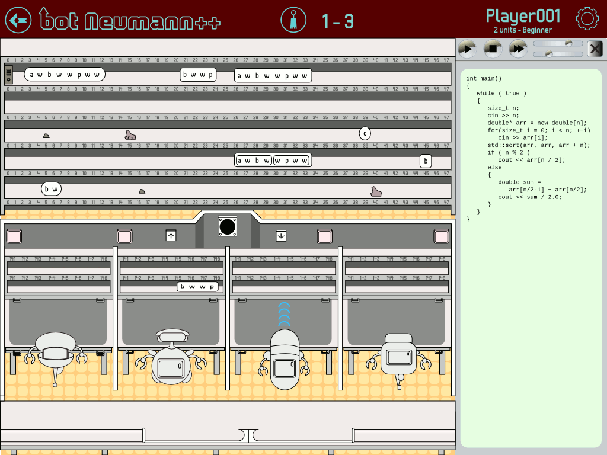

**bot Neumann\+\+** is a gamified visualisation of the von Neumann architecture intended to help students learn C/C++ programming.

## Story

Year 3000. During a long multi-centennial process of audacious effort and talent, the human species has developed a smart, huge and complex computing system that release people from all repetitive, iterative, recursive, redundant, cyclic boring tasks. Millions of processing units spread worldwide work together. It is considered the most ingenious human creation. It is, by nature, fascinating and attractive for geeks, provocative and challenging for hackers. It is the rocket that makes human success fly to reach the happiness.

Year Y3K. It was supposed to be 3000, but the system displayed Y3K instead, from 00:00 January 01 GMT. All the repetitive tasks stopped. The rocket exploded. The happiness escaped. The emergency expert committee revealed that the fail was caused by several accorded hacker attacks. Hackers exploited processing units that were codified using poor programming practices. The system and all its backups were affected.

The human species requires the help of all people with programming experience, heroes like you, in order to recover the system and make it invulnerable through secure programming practices. Because not all programmers have experience with the units, the expert committee provided a tool, called **bot Neumann** to train how to program them. The same tool can be used to fix real units. Some of them are quite complex, and requires the cooperation of several programmers working together.

## Background

The goal of Computer Science is solving problems with computers. Most of the problems require computers to do something new. The wonder of computers is that they can be instructed to do new things, through programming. Programming is considered the most inherent knowledge and ability that a computer scientist must develop. In order to program a computer, a computer scientist must know how the computer works.

Computer Science programs at university-level include several courses intended to provide an understanding of the machine, e.g.: circuits, assemblers, and architecture of computers. These courses are usually taught after introductory programming courses. We have a chicken-and-egg problem here. When taking programming courses, students require a solid understanding of the computer in order to program it well, but the courses to explain it have programming courses as requisite. Students do not require a low-level understanding of the machine in order to program it well, but a high-level understanding of it is required.

The high-level representation of the machine is provided by the programming language. It was called **notional machine** by [du Boulay in 1981](http://www.sciencedirect.com/science/article/pii/S0020737381800569). The notional machine is an abstract representation of the actual machine provided by the programming language constructs. Each programming language has its own notional machine. For example, a C programmer may think the computer has data types and it is able to execute functions.

A correct understanding of the notional machine of a high-level programming language is mandatory to program well ([Sorva, 2012](http://lib.tkk.fi/Diss/2012/isbn9789526046266/isbn9789526046266.pdf)). Students learn the notional machine through explanations given by instructors or educational materials. Static resources, such as illustrations on blackboards, book images, or videos, are not well suited to explain a highly dynamic process. Fortunately, **program visualisations** are.

From mid-80s, there have been lots of program visualisation systems. Their effectiveness as learning tools is not scientifically conclusive yet ([Sorva, 2013](http://dl.acm.org/citation.cfm?id=2543488.2490822)). Program visualisations can be harshly critiqued by learning theories. Social constructivism states that learning requires an active mind state. A student watching a visualisation is a passive actor, while the computer is the active "constructor of the knowledge".

Program visualisations are considered appropiate tools to explain the dynamic behaviour of a program running on the machine, but visualsations must be transformed in order to have students in active state. We hypothesise this goal can be achieved through gamification. **Gamification** is the process of applying game elements to a situation that is not considered a game, in order to arouse people's action, engaging, motivation, and learning (adapted from [Kapp, 2012](http://www.amazon.com/dp/1118096347)).

A gamification of a program visualisation requires to build a game with the constructs of the notional machine. In other words, the concepts provided by programming language must be used to construct a game story and a gameplay. This new goal can be achieved through metaphors. A **metaphor** is a set of correspondences between two conceptual worlds: a source (a colloquial concept) and a target (an abstract concept) ([Lakoff, 1993](http://www.cambridge.org/us/academic/subjects/psychology/cognition/metaphor-and-thought-2nd-edition)). Metaphors are natural structures of learning according to the social constructivism.

Programming concepts are already metaphors ([Colburn and Shute, 2008](http://www.sciencedirect.com/science/article/pii/S1570868308000463)). Pointers, garbage collectors and threads are colloquial concepts that programming languages borrow to name their constructs. These constructs are the actors that will perform our game. We face a new problem. The colloquial relations of these metaphors do not reflect the programming relations. For example, garbage collectors in real life do not require pointers to find or manipulate the garbage, but in computer world, they do. We hypothesise a new level of metaphors could solve it.

The  second level of metaphors can be considered as just one extended metaphor, for some authors. [tbw...]

## bot Neumann

**bot Neumman++** is defined as a gamified program visualisation of the C/C++ notional machine. Initially it is intended for memory handling and concurrency in C\+\+. It is developed as part of a research project at the University of Costa Rica. The game elements are represented with more colloquial concepts, such as: robots (execution threads), workstations (stack segments), shared tables (data segment), shelves (dynamic heap segment), pneumatic tubes (input/output streams), and so on.

bot Neumann++ is developed by Jeisson Hidalgo-Céspedes, as a research project of [Centro de Investigaciones en Tecnologías de la Información y Comunicación](http://www.citic.ucr.ac.cr/) (CITIC) of [Universidad de Costa Rica](http://www.ucr.ac.cr/), with support from the Ministerio de Ciencia, Tecnología y Telecomunicaciones (MICITT) de Costa Rica. It is licensed under GPL v2. More information:

- Game design document: English | [Spanish](docs/gdd.es.md).
- [API documentation](docs/api/)
- [Project oficial web page at CITIC](http://www.citic.ucr.ac.cr/proyecto/incentivo_lenguaje_programacion_en_estudiantes) (in Spanish)
- Informal document with [Requirements](docs/requirements.md)
- Build instructions can be found in [BUILD.md](docs/BUILD.md) file.
- License: [GPL v2](docs/LICENSE.txt)
