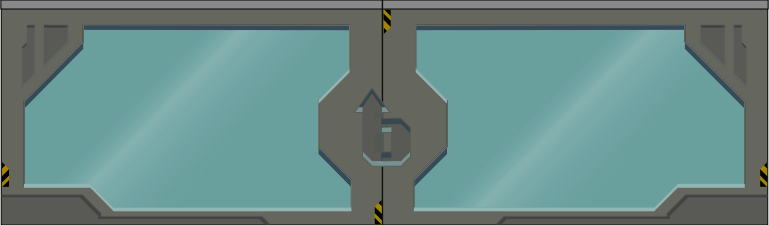

## assets

| image | description | preview |
|---|---|---|
| game_logo | logotipo del juego para iconos |  |
| game_title | nombre del juego para pantalla principal |  |
| button_back | retornar a la escena anterior |  |
| button_code_editor | show/hide code editor |  |
| button_config | player configuration/preferences |  |
| button_information | botón de información. |  |
| button_rewards | rewards |  |

## game_menu:
| image | description | preview |
|---|---|---|
| background | fondo para la pantalla de inicio/menú. |  |

## unit_selection

| image | description | preview |
|---|---|---|
| background | fondo tipo tarjeta con diferenciación de la barra de menú |  |
| chip_restored | chip "bueno" |  |
| chip_damaged | chip "dañado" |  |
| air_tube_short | segmento de tubo transparente para conectar los chips entre ellos. |  |
| air_tube_pod | cápsula que pasa dentro de los tubos entre los chips para hacer animación. |  |

## unit_playing

| image | description | preview |
|---|---|---|
| background | fondo del laboratorio |  |
| shelves_closed | Heap segment hidden to avoid cognitive overload at first levels. |  |
| shelf_left | extremo izquierdo del estante. |  |
| shelf_middle | parte interna/del medio del estante. Se repite en mosaico para generar el ancho del estante. |  |
| shelf_right | parte derecha del estante. |  |
| robot1_front | robot 1 mirando hacia el jugador, para tomar datos del segmento de datos o los tubos entrada/salida |  |
| robot1_side | robot 1 mirando de lado para hacer animación de giro |  |
| robot1_back | vista trasera del robot 1: posición de trabajo normal |  |
| robot2_front | robot 2 mirando hacia el jugador, para tomar datos del segmento de datos o los tubos entrada/salida |  |
| robot2_side | robot 2 mirando de lado para hacer animación de giro |  |
| robot2_back | vista trasera del robot 2: posición de trabajo normal |  |
| robot3_front | robot 3 mirando hacia el jugador, para tomar datos del segmento de datos o los tubos entrada/salida |  |
| robot3_side | robot 3 mirando de lado para hacer animación de giro |  |
| robot3_back | vista trasera del robot 3: posición de trabajo normal |  |
| robot4_front | robot 4 mirando hacia el jugador, para tomar datos del segmento de datos o los tubos entrada/salida |  |
| robot4_side | robot 4 mirando de lado para hacer animación de giro |  |
| robot4_back | vista trasera del robot 4: posición de trabajo normal |  |
| wave | ancho igual al de 1 char |  |
| shelf_interface | los controles para acceder a los estantes (embudo) |  |
| workstation_table | mesa del robot, pueden haber varias una encima de la otra |  |
| workstation_frame | el resto de la estación de trabajo del robot. |  |
| shared_table | mesa compartida por todos los robots: segmento de datos. |  |
| tube_in | tubo de entrada, hacerle una sección abierta de 8 bytes. |  |
| tube_out | tubo de salida: también requiere la sección abierta. |  |

## unit_playing / buttons

| image | description | preview |
|---|---|---|
| pause | pauses the visualisation to allow user to run it step by step |  |
| run | compiles the code and starts the visualisation |  |
| button_step_into | if visualisation is paused, executes the next code statement entering in functions if they are defined by user |  |
| button_step_out | if visualisation is paused, executes the next code statement in the current function |  |
| button_stop | stops the visualisation |  |

## unit_playing / data_types

| image | description | preview |
|---|---|---|
| address_0 | direccion de memoria 0, gris, del mismo color que pointer_x_null; es un espacio reservado, donde no se puede alojar nada |  |
| bool_false | representado con un círculo vacío `( )` de 1 byte |  |
| bool_right | representado con un círculo marcado `(✓)`, preferiblemente con una marca de verificación ✓ |  |
| char | romboidal de 1 byte: `/_/`, permite fácilmente hacer cadenas: `/_/_/_/_/` |  |
| int_left | rectángulo redondeado, extremo izquierdo |  |
| int_middle | rectángulo redondeado, extremo central que puede prolongarse a varios bytes |  |
| int_right | rectángulo redondeado, extremo derecho |  |
| pointer_left | es igual que el entero (int) pero de otro color, puede tener un punto de color: verde (OK), rojo (dirección inválida). Ese punto puede estar fuera del rectángulo. Puede ser una especie de antena parabólica pequeñita con esos colores |  |
| pointer_left_ok | antena con luz verde (OK) | 
| pointer_left_invalid | antena con luz roja (dirección inválida) | |
| pointer_middle | extremo central del apuntador, que se puede extender por varios bytes |  |
| pointer_right | extremo derecho del apuntador |  |
| float_left | rectángulo con esquinas cuadradas, extremo izquierdo. Nota ya no es necesario el double, ni el long double |  |
| float_middle | rectángulo con esquinas cuadradas, extremo central que puede extenderse |  |
| float_right | rectángulo con esquinas cuadradas, extremo derecho |  |
| struct_left | el tubo para agrupar tipos de datos diferentes (el tubo que contiene otros tubos), debe ser transparente y sus bordes ocupar el menor espacio posible |  |
| struct_middle | parte central del tubo que puede extenderse |  |
| struct_right | extremo derecho del tubo |  |
| array_struct_left | unión rosca para pegar dos tubos de struct (left) |  |
| array_struct_right | unión rosca para pegar dos tubos de struct (right) |  |
| waste1 | basura, escombro dibujo 1 |  |
| waste2 | basura, escombro dibujo 2 |  |
| waste3 | basura, escombro dibujo 3 |  |
